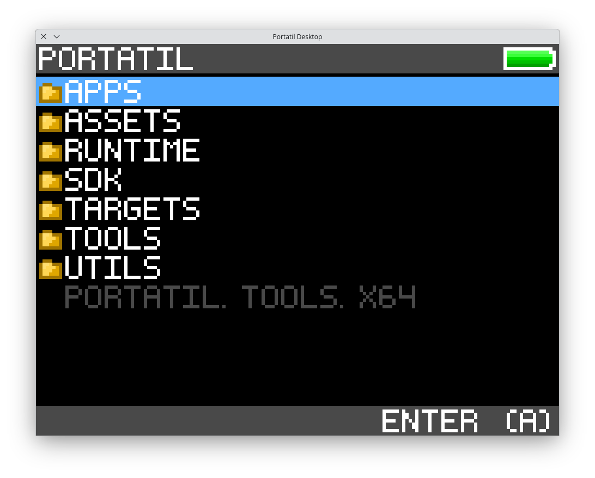
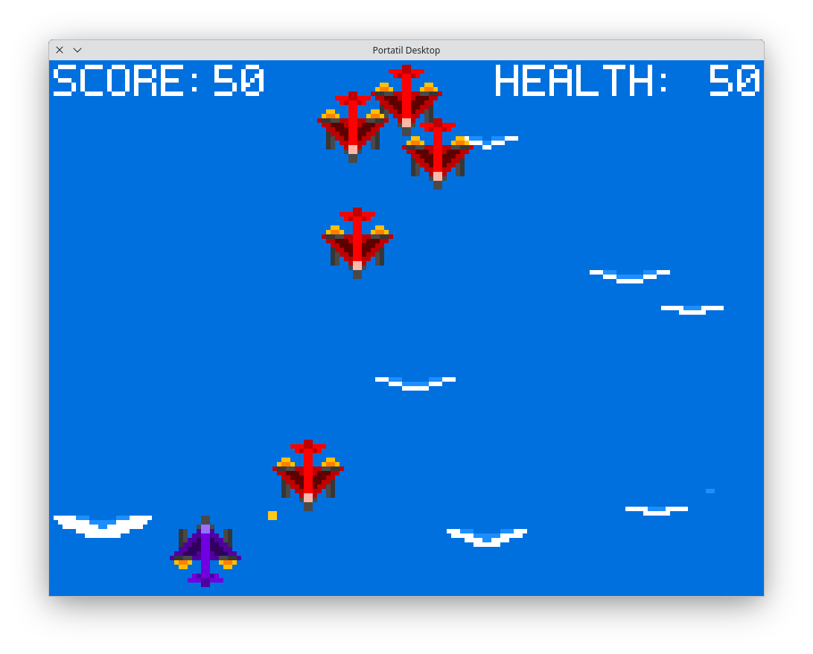
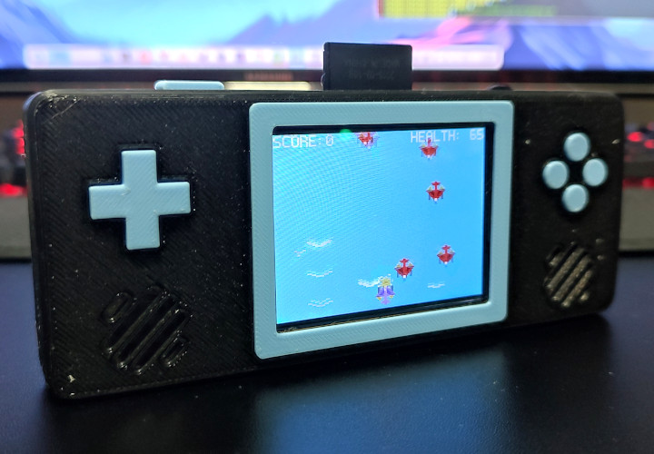

# Portatil

A "made-real" fantasy retro gaming console.





Portatil is a virtual machine based gaming console that runs RISC-V applications with custom system calls.

Runtimes can be easily ported to new targets by implementing specific drivers as kernel and engine code are target agnostic. Currently there are runtimes for Linux/SDL (mainly for development) and RaspiberryPi Pico (using RP2040 Zero from Waveshare).

## Virtual Machine Specifications

- CPU: RV32I instruction set (with custom fixed point math library).
- Memory: 32KB of RAM.
- Input: 8 digital inputs (left, right, up, down, a, b, x, y).
- Graphics: 160x120, 256 color framebuffer.
- Sound: 4 channel, 22KHz, 8-bit wave generator (sawtooth, square and triangle waves).
- 2D Engine: 4 layers, 256 sprites total, 128 entities on screen, basic physics simulation.
- Storage: FAT-32 formatted SD cards (read-only).

## Directory Structure

```sh
-- 3D Parts/    # 3D printable console shell
---- STL/       # exported parts for printing
-- Docs/        # hardware and software reference
-- Hardware/    # schematics and PCB design
-- Software/    # runtime and tools
---- Apps/      # demo application
---- Assets/    # runtime assets
---- Runtime/   # runtime code
------ Drivers/ # target specific code/drivers
------ States/  # high-level runtime code
---- SDK/       # C SDK
---- Targets/   # runtime targets
---- Tools/     # development tools
---- Utils/     # utilities
```

## TODO

There is still a lot of things to be done:
- Add actually usefull documentation to this repository;
- Create boilerplate code for new games;
- Write a tutorial on how to create your first game;
- Implement a Windows/SDL runtime;
- Add support for Windows based toolchains (to be able to compile games in Windows);
- Implement FAT-32 writing support;
- Add support for game saving;
- Add support for game thumbnails;